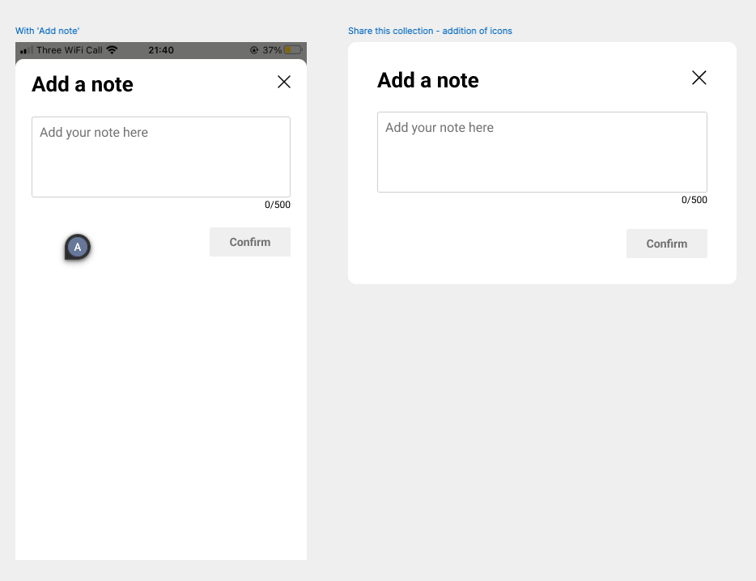

#  &nbsp;Moonsift Fullstack Takehome Challenge

👋 Thank you for your interest in working together. This is meant to be a short and hopefully fun exercise to give us a sense of your work and to help you understand what sort of things we might be doing together.

Please let us know if you have any feedback, we are always happy to improve our process.

The challenge will have two parts:

1. **Take home element**: a short assignment detailed below, resulting in some code deliverables
2. **Discussion, pair programming**: we will go over your solution together and discuss your approach, choices and how the code base could be improved further

## 📖 Description

The Moonsift take home assignment consists of a simple React application with a single view. The page is a Collection view, showing a list of products a user has saved on the Moonsift platform to be grouped together. This is the heart of the Moonsift wishlist application.

## 📋 Notes on the challenge

- 🤔 We use this challenge to better understand your way of thinking and how you approach a problem. Be sure to document your choices (code comments, README, at the live discussion etc.)
- ⌛ Please do not spend too much time on this. It is meant to be a starting point for a discussion. Ideally we think it can be done in ~4 hours.
- 💻 We are not looking for a specific technology or solution. We want to see how you think and justify design decisions. Please feel free to bring in new dependencies and generally choose technologies that you think are best. (as long as the front-end remains a React + Typescript project)
- 🤖 You can use AI tools to help you with the challenge, but please walk us through how you used them and how you made sure the product was up to standard.
- ✍️ Once you're done, replace this README with your notes. Also include instructions on running your final product.
- 📬 Please submit your final solution in the form of a GitHub repository and add `badrequest400` and `moonsift` as collaborators so we may view and clone your solution.
- 📅 Please try to get this back to us in 5 days, but do let us know if you need more time.
- ❔We expect some assumptions and initiative on this challenge, to give you the freedom to work your way, but do reach out with any questions you may have.

## 🚀 Challenge

Aside from the below new features, **this is also a refactoring and cleanup exercise.** We would like to see your approach to refactoring just as much as your solution for the additions. Your attention to detail and ability to quickly cut through the noise is key.
You should **not** have time to make this production ready or perfect. You will need to prioritise aggressively and keep your refactoring to the most important areas. Make notes on what else you would do given more time.

We will review your solution and discuss the choices you have made together in the review meeting. Please make brief notes of your choices and the reasoning behind them.
- What assumptions did you make?
- What did you choose to spend time on? What did you consider less important, decide to cut from scope or cut corners on?
- What would you have done differently or what else would you have done if you had more time?

> [!NOTE]
> **Everything** in this repository is fair game to change. Don't be afraid to delete/modify/add/rename as long as the app is runnable and satisfies the brief. How could you improve the codebase? **We are not looking for you to submit a fully perfected codebase**, but please think about and document bringing the repository up to a standard that you would be happy with.

> [!TIP]
> Hint: Look at doing some refactoring first and simplify the component hierarchy. Focus on the new additions after. This should make your work easier.

### 🖼️ Front-end

Add a new feature to the product tiles to allow people to add notes to a saved product (see wireframes below, pixel perfect is not the aim here).

> [!IMPORTANT]
> Many of the buttons do nothing and are only placeholders. This is fine. We do not expect you to address any functionality aside what is described below.
> Also you can safely disregard the framework folders (`ui` and `common`). Only concentrate on refactoring the main presentational components in `src/components` root.

1. Add a new icon at the bottom of the product tiles to allow people to add or edit notes
2. Implement a modal that is displayed when the notes icon is clicked and allows the user to add a note or edit their existing note
3. The modal should allow for adding a new note as well as display an existing note and allow for editing it (a note is a singular string against a product, it either exists or it doesn't)

🌟 Bonus: There are a couple of discrepancies in the app compared to the wireframes. See if you can fix these.

### 💾 Back-end

To enable the new notes feature, we will need some kind of data persistence. Please add a database of your choosing and add the necessary code to retrieve products and add notes to them.

1. Add a new database of your choosing to the project
2. Design a data model based on the dummy data found in `src/data.json` and implement it in the database
3. Once the DB implementation is done, seed the DB with the provided product data. Start using "live" product data from the DB and ditch the `src/data.json` flat file
4. Expand on the data model to allow for notes to be added to products

### Wireframes

